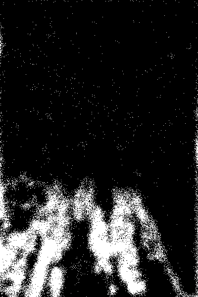
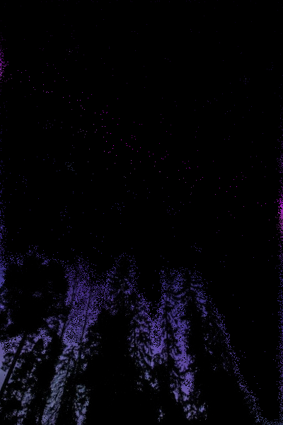

# voronoi-filter

An implementation of Voronoi image filtering, based on random dithering and Voronoi diagrams.


## Usage

Firstly, install the required dependencies.

```bash
pip install -r requirements.txt
```

Then, you can run the main script to filter the image at `input.jpg` to `out.png`.

```bash
python main.py
```

## Overview

The steps of the algorithm are:

1. Find the edges of the image with [ImageFilter.FIND_EDGES](https://pillow.readthedocs.io/en/stable/reference/ImageFilter.html).

   

2. Blur the edges with [ImageFilter.GaussianBlur](https://pillow.readthedocs.io/en/stable/reference/ImageFilter.html#PIL.ImageFilter.GaussianBlur).

   

3. Create a probability distribution of points based on the blurred edges, and sample from that distribution to determine the coordinates of the Voronoi nodes.

   

4. Obtain the colors of the Voronoi nodes from the original image.

   

5. Determine the closest Voronoi node for each pixel (very slow).

   

You can specify various options for the algorithm, such as ratio of points to sample, the baseline probability, and the distance metric to use for determining the closest node.

For example, using the `distance_metric="euclidean"` produces the following image:


## Notes

This effect is most effective on images with distinct edges and a clearly defined foreground, middleground, and background.

This algorithm is very computationally expensive, and is not suitable for large images. You can adjust for performance by reducing the resolution of the image and/or using a lower `proportion_points`.
